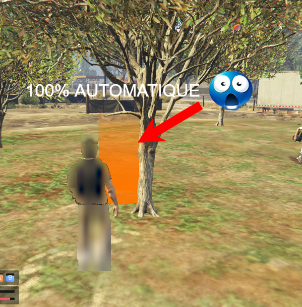
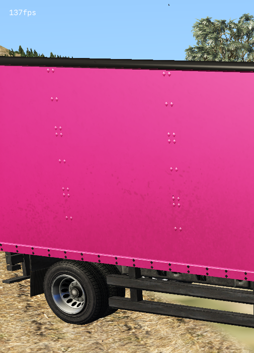

# Système autonome de farm pour UnityRP v2
<p align="center">
  
</p>

---
Ce projet fonctionne par vision par ordinateur via des masques hsv en utilisant opencv pour capter des faisceaux. Il est uniquement à but d'éducation et d'analyse.
Il est aussi spécifiquement destiné au serveur UnityRP V2 de FiveM. 

Celui-ci gère automatiquement **déplacement**, **détection des cercles**, **récolte**, **consommation** et **pose des objets récoltés dans un coffre** : [Camion](#camion)

## Sommaire

- [Prérequis](#prérequis)
- [Utilisation](#utilisation)
- [Camion](#camion)
- [Conseils d'utilisation](#conseils-dutilisation)
- [Contrôles](#contrôles)
- [License](#license)

## Prérequis
[Git](https://git-scm.com/), Le reste est automatiquement installé en lançant [start.bat](start.bat)

##  Utilisation
Dans une invite de commande : 
```cmd
git clone https://github.com/qaep/unityrp-autofarm
```
```cmd
cd unityrp-autofarm
```
```cmd
.\start.bat
```

## Camion
Afin d'utiliser la fonctionnalité pour poser les items récoltés dans un camion ou un véhicule, il faudra impérativement que votre camion ait cette couleur rose pour qu'il soit détecté: 

## Conseils d'utilisation
Je conseille l'utilisation de packs graphiques permettant qu'il fasse toujours jour afin d'avoir une luminosité optimale ainsi qu'un mod pour lisser les terrains et un mod pour enlever la végétation environnantes pour une utilisation du système idéale.

### Contrôles
- **F8** : Afficher les statistiques
- **F9** : Mettre le système en pause
- **F10** : Arrêter

### License

**This project is licensed under the MIT License. See [LICENSE](LICENSE) for more details.**
